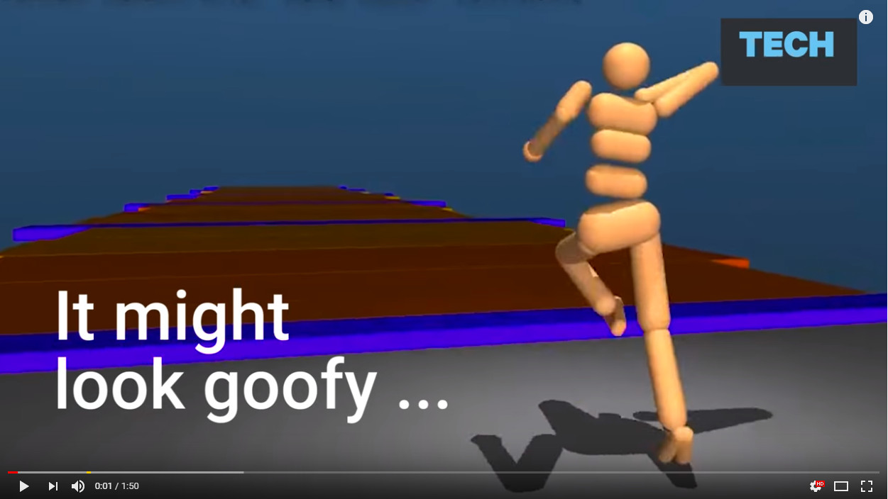
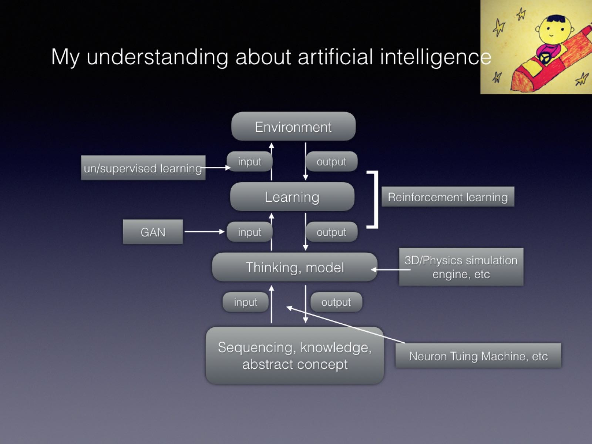

# DL in an hour, a personal perspective

## Fundament

1. Fit, aprroximation, interpolation, estimation, predict

<!--  -->

2. case in real life, spline
    * https://www.ibiblio.org/e-notes/Splines/nurbs.html
    * https://www.ibiblio.org/e-notes/Splines/bezier3d.html

2. Universal [approximation](https://zhuanlan.zhihu.com/p/23186434) theorem
    * [UAT](https://en.wikipedia.org/wiki/Universal_approximation_theorem)
    
    
    
    * spline appr
    
    
    <!-- <canvas id="canvas" width="500" height="500"></canvas>  -->

    * multi-diemensions

    

    * image, cases of low dimension embedded

    
    

4. https://github.com/NirViaje/DeepLearningRobotics/blob/master/NeuronTalk.md
    * Hebbian, naive ANN
      * where the neuron is?
      
      

      * matrix and non-linear
      
      
      
      

    * XOR, [multi-layer](https://playground.tensorflow.org/)

    
    

    * principle

      * info redundant, constrain (cnn, dimension reduction

    

      * info distill (auto-encoder/LeNet

    
    
    * localize, convolution, primary visual cortex of mammal, DCT

      

      * huge number of weights/paras

      
      
      * visual cortex, DCT

      
      
      
      

      * localize, convolution
    * LeNet, AlexNet, VGG, GoogLeNet inception, ResNet

    
    

      * timeline, go deep, [Autoencoder](https://www.slideshare.net/billlangjun/simple-introduction-to-autoencoder), Hinton 2006

    

      0. LeNet, 1998

    
    
    

      1. [AlexNet](https://my.oschina.net/u/876354/blog/1633143), 2012,  ImageNet Challenge

    

      2. [Vgg](https://blog.csdn.net/qq_40027052/article/details/79015827), 2014, Visual Geometry Group - University of Oxford

    
    

      3. [GoogLeNet inception](https://my.oschina.net/u/876354/blog/1637819), 2014

    

      4. ResNet, 2015 Dec

    
    

      * [Survey](https://www.topbots.com/a-brief-history-of-neural-network-architectures/)

    
    
    
    

      * build blocks, [ReLu 1996/2010](https://www.zhihu.com/question/61265076/answer/260492479), with leakage, pooling, dropout etc

    
    

      * optimization, training, backpropagation, [Andrew Ng's course](https://mooc.study.163.com/smartSpec/detail/1001319001.htm)

      
      

5. Gu@SUNY, manifold

    

6. what's more
    * detect, track, Yolo/openPose etc
    * LSTM
    * GAN
    * DRL
    
    
    
    
    * connect concrete and abstract
      * [Deep Learning and Geometry, by Xianfeng Gu](https://mp.weixin.qq.com/s/Upkci9ovvrlmA7EhqmNd0g)
      * the figure of three stage
    * further methodology
      * non-BP
      * unsupervised
      * etc
7. a little bit more on AGI
    * [AIXI](https://www.zhihu.com/question/34393952/answer/65205814)
    * 
8. fully DL rendered movie?
    * [nVidia be a render company again](https://zhuanlan.zhihu.com/p/31627466)
 
## HandsOn

1. available workbench in lab
    * 1080Tix3
    * P40x2
2. [Deepo](https://github.com/ufoym/deepo)
3. [git](http://www.ruanyifeng.com/blog/2015/12/git-cheat-sheet.html)

## Several Cases

1. on Aesthetic, eyes movement
2. [scratch2code](https://zhuanlan.zhihu.com/p/33277230)
3. [coloring](https://zhuanlan.zhihu.com/p/31965450)
4. more

<!-- 

 
 
 
 
 
 
 

  -->
